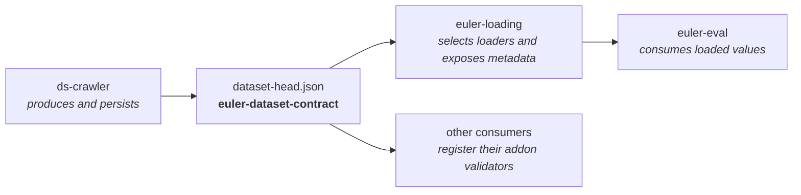

<!-- euler header — shared across the euler packages.
     Per package, change only: the <h1>, the tagline, and the badge URLs. -->
<p align="center">
  
</p>

<h1 align="center">euler-dataset-contract</h1>

<p align="center">
  <em>One small, versioned metadata boundary for Euler datasets.</em>
</p>

<p align="center">
  <a href="https://pypi.org/project/euler-dataset-contract/"></a>
  <a href="https://pypi.org/project/euler-dataset-contract/"></a>
  <a href="LICENSE"></a>
  <a href="https://github.com/d-rothen/euler-dataset-contract/actions/workflows/ci.yml"></a>
</p>

---

`euler-dataset-contract` defines and validates the shared `dataset-head.json`
format used across the Euler data tooling. It keeps dataset identity, modality
semantics, and package-specific extensions in one dependency-free Python
package instead of duplicating those rules in every producer and consumer.



The package intentionally does not crawl files, load arrays, or import NumPy or
PyTorch. Its core install has no runtime dependencies.

## Install

```bash
pip install euler-dataset-contract
```

Python 3.9 or newer is required.

## Quick start

A dataset head describes one logical dataset modality:

```python
from euler_dataset_contract import parse_dataset_head

head = {
    "contract": {"kind": "dataset_head", "version": "1.0"},
    "dataset": {
        "id": "foggy_depth",
        "name": "Foggy Drive Depth",
        "attributes": {"split_origin": "capture_2026"},
    },
    "modality": {
        "key": "depth",
        "meta": {
            "radial_depth": False,
            "scale_to_meters": 0.001,
            "range": [0, 80],
            "file_types": ["png"],
        },
    },
    "addons": {
        "euler_loading": {
            "version": "1.0",
            "loader": "generic_dense_depth",
            "function": "depth",
        }
    },
}

contract = parse_dataset_head(head)
contract.dataset_id                    # "foggy_depth"
contract.modality_key                  # "depth"
contract.meta["scale_to_meters"]       # 0.001
contract.get_addon("euler_loading")    # package-owned extension payload
contract.to_mapping()                  # canonical, detached mapping
```

Invalid structural fields, missing modality metadata, malformed versions, and
registered addon violations raise `ValueError` with a field-qualified message.
Unknown modality keys remain valid and may carry arbitrary metadata, allowing
the ecosystem to add modalities without first releasing this package.

## Extensions

The shared contract requires every addon payload to be an object with its own
version. A consuming package can register the rest of its validation rules:

```python
from euler_dataset_contract import (
    register_addon_validator,
    validate_slot,
)

def validate_training_addon(value, context):
    validate_slot(value.get("slot"), f"{context}.slot")

register_addon_validator("euler_train", validate_training_addon)
```

Addon validators are process-wide. Register them during package import or
application startup, and pass `overwrite=True` only when intentionally
replacing an existing validator.

## JSON Schema

Generate Draft 2020-12 schemas from the same registry used by runtime
validation:

```python
from euler_dataset_contract import (
    build_dataset_head_schema,
    build_meta_schema,
)

dataset_head_schema = build_dataset_head_schema()
modality_catalog_schema = build_meta_schema()
```

The repository also publishes generated schemas under [`schemas/`](schemas/).
`build_dataset_head_schema()` selects the appropriate metadata rules from the
sibling `modality.key`; custom modality keys accept optional custom metadata.

## Built-in modality metadata

| Modality key | Required metadata |
|---|---|
| `rgb` | `range` |
| `depth` | `radial_depth`, `scale_to_meters`, `range` |
| `segmentation` | `skyclass` |
| `semantic_segmentation` | `skyclass` |

All registered modalities may additionally use the shared `dimensions` and
`file_types` fields. `build_default_meta(key)` returns authoring defaults;
parsing never silently fills missing required fields. Producer tooling such as
`ds-crawler` may merge defaults before it validates and writes a head.

See [the contract reference](docs/contract-reference.md) for field semantics,
normalization, versioning, and the public API.

## Ecosystem boundary

The current 1.0 contract describes persisted dataset metadata. It does not yet
guarantee the exact decoded tensor layout, dtype, coordinate frame, or value
domain returned by a loader. In practice, `euler-loading` owns those decoding
rules and downstream packages normalize its outputs.

The observed gaps and a staged, backwards-compatible route toward canonical
modality names and enforceable decoded-output contracts are documented in
[Future contract directions](docs/future-directions.md).

## Development

```bash
git clone https://github.com/d-rothen/euler-dataset-contract.git
cd euler-dataset-contract
uv sync --extra dev
uv run ruff check .
uv run pytest
uv build
uv run python scripts/verify_distribution.py dist/*
```

See [CONTRIBUTING.md](CONTRIBUTING.md) for schema changes and release checks,
and [SECURITY.md](SECURITY.md) for private vulnerability reporting.

## License

[MIT](LICENSE) © Daniel Rothenpieler
