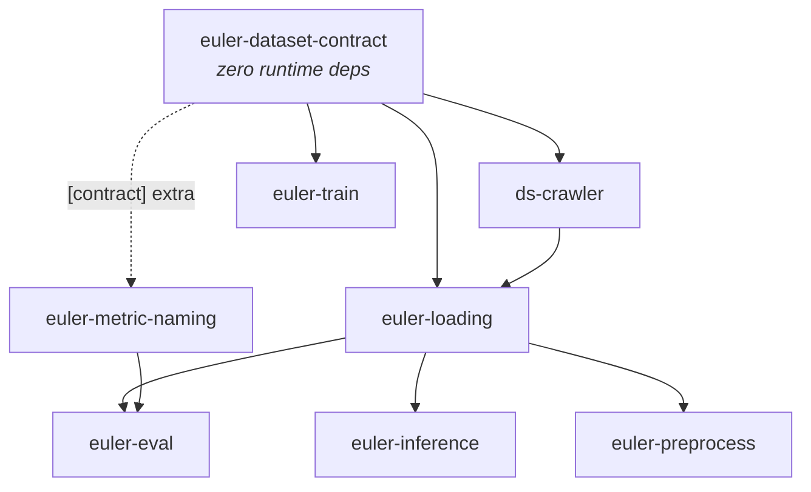

# Ecosystem streamlining plan

This document answers a concrete question: **should modality handling be
streamlined into a new `euler-registry` package, or by extending
`euler-dataset-contract`?** It then specifies the design and a staged rollout.

It is the executable successor to [Future contract directions](future-directions.md),
which established the direction. This document establishes *what to build*, in
what order, and what evidence justifies each step. Where it disagrees with the
earlier document, the disagreement is called out explicitly.

---

## 1. Recommendation in one page

**Extend `euler-dataset-contract`. Do not create `euler-registry`.**

`euler-dataset-contract` is already the universal root of the ecosystem
dependency graph. Every package reaches it, directly or transitively:



A new registry package would add a second root, an edge to seven repositories,
a synchronized release, and a permanent ambiguity about which package owns
modality identity. Extending the existing root costs **zero new dependency
edges**. The package already has the two extension mechanisms
(`register_modality_meta_fields`, `register_addon_validator`), the
`_dataset_contract.py` per-consumer convention, and no runtime dependencies —
exactly the properties a registry needs. `euler-metric-naming` already treats
it as *the* modality authority.

Three refinements to the brief, argued in full below:

| # | The brief said | This plan proposes | Why |
|---|---|---|---|
| 1 | Key is `<domain>.<subject>.<representation>.<quantity>` | Key is `<domain>.<subject>.<quantity>`; representation is a **separate typed field** | Putting representation in the identity forks identity on every encoding change: a fisheye camera would need a new modality, and `semantic_segmentation` would need one id per encoding. §5 |
| 2 | Output format either via a primitives library or user transforms | **Neither by hand.** Declare decoded profiles; a *planner* derives the adapter chain from the delta, or fails with a precise reason | Hand-written converters are O(n²) and unverifiable; user transforms stay, but run after normalization. §7 |
| 3 | Extensions propagate by "defining custom modalities on startup" | **Data, not code**: packaging entry points, an env path, and an inline definition carried in the head itself | Startup registration cannot propagate into a `DataLoader` worker, a CLI subprocess, or someone else's machine. §6 |

The single highest-leverage change is small and mostly already written:
`euler-loading` annotates **every** loader function with `@modality_meta(...)`
describing dtype, shape, unit and range — and then throws it away into a
build-time JSON file that nothing reads at runtime. Promoting that declaration
to a validated, contract-owned, runtime-queryable object is what makes "given
arbitrary datasets, normalize to a common representation" mechanically true
rather than aspirational.

---

## 2. What is actually broken today

Every item below was verified against the working trees, not inferred from
documentation. These are the failures a contract has to make impossible.

### 2.1 The head's metadata is validated but not consumed

The contract requires `scale_to_meters` for `depth`
(`euler_dataset_contract/registry.py:192`). No loader reads it. `vkitti2.depth`
declares `scale_to_meters: 0.01` in its annotation and then hardcodes the
conversion:

```python
# euler-loading/euler_loading/loaders/gpu/vkitti2.py:76,84
meta={"raw_range": [0, 65535], "radial_depth": False, "scale_to_meters": 0.01},
...
arr = np.array(Image.open(path), dtype=np.float32) / 100.0
```

A dataset that stores millimetres and correctly declares
`scale_to_meters: 0.001` is silently decoded as centimetres. The contract
validated the field and the loader ignored it. This is the defining failure:
**metadata that no consumer is obliged to honour is decoration.**

### 2.2 The same quantity has three names, and the validated one is unused

| Name | Where | Read by |
|---|---|---|
| `skyclass` | contract, **required** for `segmentation` (`registry.py:164`) | nothing |
| `meta["sky_mask"]` | `generic_dense_depth.sky_mask` (`:156`) | that loader |
| `meta["sky_color"]` | `vkitti2.write_sky_mask` (`:245`) | that writer only — the *reader* hardcodes `(90, 200, 255)` (`vkitti2.py:114`) |

Authoring a valid head for a segmentation dataset therefore produces a field
no code path uses, while the field the loader needs is undeclared.

### 2.3 One declared modality type, several incompatible decoded values

From `loaders.json`, `semantic_segmentation` is emitted by four loaders:

| Loader | dtype | cpu | gpu | Actually returns |
|---|---|---|---|---|
| `generic` | uint8 | HW | HW | class ids |
| `muses` | int64 | HW | 1HW | class ids |
| `real_drive_sim` (`class_segmentation`) | int64 | HW | 1HW | class ids |
| `vkitti2` (`class_segmentation`) | int64 | **HWC** | **CHW** | **raw RGB palette triplets** |

`vkitti2.class_segmentation` returns `(3, H, W)` of RGB values, not labels. The
only discriminator is `meta={"encoding": "rgb"}` inside the decorator — which
lives in a build artifact and never reaches a consumer. A consumer that
correctly handles the other three silently misinterprets VKITTI2.

### 2.4 Identity, cardinality and representation are conflated in the type name

- `extrinsics` (vkitti2, shape `Nx1`, raw `np.loadtxt` output) versus
  `camera_extrinsics` (muses / princeton_dense / real_drive_sim, `4x4`). Same
  semantic quantity, different names *and* incompatible shapes.
  `euler-eval`'s `to_numpy_extrinsics` accepts only `(4,4)` or `(3,4)`
  (`data.py:153`), so VKITTI2 extrinsics cannot be evaluated at all.
- `all_intrinsics` is not a modality — it is `intrinsics` with cardinality
  *many*.
- `calibration` is not a modality — it is a bundle.
- `muses.reference_rgb` maps to type `rgb`. "Reference" is a *role*, not an
  identity; roles already belong in the `used_as` addon field.

### 2.5 Consumers guess, because there is nothing to ask

`euler-loading` infers semantics from substrings of the config name and the
filesystem path (`_metadata.py:213`):

```python
if any(token in lowered for token in ("rgb", "image", "img", "color", "colour")):
    return "rgb"
if any(token in lowered for token in ("depth", "disparity")):
    return "depth"
```

`disparity` is not depth. This also directly violates the existing guardrail
"never infer a semantic change solely from a path or sample key".

`euler-eval` guesses layout from shape and raises on the ambiguous case
(`data.py:88`):

```python
elif arr.shape[0] == 3 and arr.shape[-1] == 3:
    raise ValueError(f"Ambiguous RGB layout for shape {arr.shape}. ...")
```

A 3×W×3 image is simply unloadable — not because the information is missing,
but because it is not carried.

### 2.6 Defaults disagree across the boundary

| Field | `euler-dataset-contract` | `euler-eval` |
|---|---|---|
| `radial_depth` | `False` (`registry.py:190`) | `True` (`data.py:1094`) |

Opposite defaults for a geometry-critical flag, on either side of the seam.

### 2.7 Consumers have invented private, unvalidated meta vocabularies

`euler-eval` reads `representation`, `coordinate_unit` and `columns` from
`modality.meta` (`data.py:1105`). None exist in the registry. They are legal
only because `meta` is open. This is the contract being extended *by
convention*, in exactly the place the plan should formalize.

### 2.8 Third-party loaders are impossible

`euler-loading` resolves loaders from a hardcoded dict of seven entries
(`_resolution.py:21`). There is no registration path. A researcher adding a
dataset must patch `euler-loading` — the exact "major patch throughout the
repositories" the brief wants to eliminate.

### 2.9 The generated schema is vendored and already stale

`euler-view/src/lib/const/ds-crawler.meta.json` is a checked-in copy of
`build_meta_schema()` output. It is missing the `segmentation` modality. Any
consumer outside Python has no live way to obtain the registry.

---

## 3. The model: three contracts, not two

The brief frames this as input versus output. There are three, and the middle
one — the only one that can be checked against reality — is the one that does
not exist today.

```text
stored bytes ──decode──▶ decoded value ──adapt──▶ requested value
     │                        │                        │
 storage profile        decoded profile         requested profile
 (head.modality.meta)   (loader declares)       (consumer declares)
   partly exists      exists only as docs         does not exist
```

| Contract | Owner | Answers | Today |
|---|---|---|---|
| **Storage** | dataset author, in the head | How are the bytes encoded? | `modality.meta`, partial and partly unread (§2.1) |
| **Decoded** | loader author, beside the function | What exactly does this callable return? | `@modality_meta` → build-time JSON only |
| **Requested** | consumer, at call time | What do I need? | nothing; heuristics (§2.5) |

Two consequences follow directly, and they shape the whole plan:

1. **Normalization is a function of decoded → requested.** It cannot be
   implemented generically until *decoded* is machine-readable at runtime. This
   is why promoting `@modality_meta` is the first real step and not a
   nice-to-have.
2. **The decoded profile is falsifiable.** Unlike storage metadata, it can be
   checked by decoding one sample and comparing. That is the mechanism that
   turns "robust" into "verifiable", and it catches §2.1, §2.3 and §2.4
   automatically.

---

## 4. Where each piece lives

### 4.1 Repository map

Most phases touch several packages. All repositories are siblings under
`/srv/ao/workspaces/admin/`, each on `main`, each with a
`<repo>-worktrees/` directory alongside it for agent worktrees.

| Repository path | Import package | Distribution | Version | Role in this plan |
|---|---|---|---|---|
| `euler-dataset-contract` | `euler_dataset_contract` | `euler-dataset-contract` | 0.3.0 | **Root.** Registry, identity, profiles, fixtures, CLI |
| `ds-crawler` | `ds_crawler` | `ds-crawler` | 2.10.0 | Producer: authors and persists heads |
| `euler-loading` | `euler_loading` | `euler-loading` | 2.22.0 | Decoder: loader registry, profiles, adapter planner |
| `euler-eval` | `euler_eval` | `euler-eval` | 2.25.0 | Consumer: declares accepted profiles |
| `euler-inference` | `euler_inference` | `euler-inference` | 2.7.0 | Consumer: requests profiles |
| `euler-preprocess` | `euler_preprocess` | `euler-preprocess` | 3.13.0 | Consumer: requests profiles |
| `euler-train` | `euler_train` | `euler-train` | 2.11.0 | Addon owner: shared role vocabulary |
| `euler-metric-naming` | `euler_metric_naming` | `euler-metric-naming` | dynamic | Validates modalities against the registry |
| `euler-view` | `src/` (TypeScript) | — | — | Non-Python schema consumer; stop vendoring (§2.9) |

Paths are relative to `/srv/ao/workspaces/admin/`. A worktree for repo `X`
lives at `X-worktrees/<branch-name>/`.

### 4.2 Ownership

Keep the boundary the ecosystem already has. Add to the root; do not move
behaviour into it.

| Package | Gains | Explicitly does **not** gain |
|---|---|---|
| `euler-dataset-contract` | modality registry, identity grammar, alias map, representation vocabulary, profile model, conformance fixtures, `euler-contract` CLI | NumPy, torch, file I/O, array conversion |
| `euler-loading` | loader **registration**, runtime profile exposure, the adapter planner and its ops, `want=` on `Modality` | modality identity or vocabulary ownership |
| `ds-crawler` | authoring against the registry; alias normalization on write | decoded-side concerns |
| `euler-eval` | declares accepted profiles; deletes `to_numpy_*` heuristics | its own meta vocabulary (§2.7 migrates in) |
| `euler-inference`, `euler-preprocess` | request profiles instead of assuming layouts | — |
| `euler-metric-naming` | modality validation against real ids | — |

The contract package stays dependency-free and array-free. It describes and
validates; `euler-loading` executes. This is the existing boundary, and it is
the right one.

---

## 5. Modality identity

### 5.1 Grammar

```text
<domain>.<subject>.<quantity>
```

Three segments, lowercase `[a-z][a-z0-9_]*`, dot-separated. Examples:

```text
geometry.camera.intrinsics
geometry.camera.depth
geometry.scene.points
appearance.camera.color
semantics.camera.class_labels
radiometry.scene.scattering_coefficient
```

- **domain** — the field of meaning: `geometry`, `appearance`, `semantics`,
  `radiometry`, `signal`.
- **subject** — what the quantity is attached to: `camera`, `scene`, or for the
  `signal` domain the index space (`grid`, `sphere`, `set`).
- **quantity** — the measured thing.

### 5.2 Why three segments and not the proposed four

The brief proposed `<domain>.<subject>.<representation>.<quantity>`, e.g.
`geometry.camera.pinhole.intrinsics`. Recommend against, for three reasons:

1. **It forks identity on encoding changes.** A fisheye camera would become
   `geometry.camera.fisheye.intrinsics` — a *different modality*. A consumer
   that wants "the intrinsics" would have to enumerate every camera model that
   exists or will exist. The same failure recurs for
   `semantic_segmentation` (class-id vs RGB palette, §2.3), for depth (planar
   vs radial), and for points (map vs cloud).
2. **It re-creates the exact confusion `future-directions.md` §1 identifies** —
   that the current names mix "true semantic differences, storage/encoding
   differences, and aliases". Encoding in the key is that mixture, promoted to
   syntax.
3. **The registry can no longer answer the useful question.** "Do these two
   datasets hold the same quantity?" becomes a prefix-match with an open tail,
   rather than an equality test.

Representation belongs in a sibling field, where it is typed, queryable, and
free to vary without touching identity:

```json
{
  "modality": {
    "id": "geometry.camera.intrinsics",
    "representation": {"model": "pinhole", "layout": "matrix_3x3"}
  }
}
```

This satisfies "simple without infringing on exactness" better than the
four-segment form: the id stays short and stable, and exactness moves to a
place where it can carry constraints (`fx > 0`, `image_plane`, units) that a
name segment never could.

### 5.3 Starter registry

The full mapping of everything the ecosystem emits today. `alias` entries stay
readable and resolvable through a deprecation window; they are never silently
rewritten.

| Legacy name(s) | Modality id | Representation carries |
|---|---|---|
| `rgb` | `appearance.camera.color` | `layout`, `value_domain`, `color_space` |
| `rccb` | `appearance.camera.color` | `filter_array: rccb`, `channels` |
| `depth` | `geometry.camera.depth` | `depth_kind: planar_z\|radial`, `unit`, `invalid` |
| `intrinsics` | `geometry.camera.intrinsics` | `model`, `layout`, `image_plane` |
| `all_intrinsics` | `geometry.camera.intrinsics` | *(cardinality `per_sensor`, §8)* |
| `extrinsics`, `camera_extrinsics` | `geometry.camera.extrinsics` | `layout`, `direction`, `source_frame`, `target_frame` |
| `calibration` | *(composite — a binding, not a modality)* | — |
| `points_3d` | `geometry.scene.points` | `form: point_map`, `axes` |
| `point_cloud`, `lidar_point_cloud` | `geometry.scene.points` | `form: point_cloud`, `columns` |
| `sparse_depth` | `geometry.scene.points` | `form: point_cloud`, `columns` |
| `scene_flow` | `geometry.scene.flow` | `axes`, `unit` |
| `segmentation`, `semantic_segmentation`, `class_segmentation`, `semantic_segmentation_color` | `semantics.camera.class_labels` | `encoding: class_id\|rgb_palette`, `palette`, `label_space` |
| `instance_segmentation` | `semantics.camera.instance_labels` | `encoding` |
| `panoptic_segmentation` | `semantics.camera.panoptic_labels` | `encoding` |
| `sky_mask` | `semantics.camera.mask` | `class: sky` |
| `atmospheric_light` | `radiometry.scene.atmospheric_light` | `axes` |
| `scattering_coefficient` | `radiometry.scene.scattering_coefficient` | `unit` |
| `sh_coeffs` | `radiometry.scene.sh_coefficients` | `order`, `basis` |
| `map_2d` | `signal.grid.scalar` | `axes`, `unit` |
| `map_3d` | `signal.grid.vector3` | `axes` |
| `spherical_map` | `signal.sphere.vector3` | `projection` |

Three things this table settles that the current names cannot:

- `sparse_depth` and `lidar_point_cloud` are the **same quantity**; "sparse
  depth" describes a *use* (`euler-eval` projects it into the prediction
  plane), not an identity. The registry forces that admission.
- `all_intrinsics` and `calibration` are **not modalities**. They are
  cardinality and bundling, handled by binding (§8).
- `sky_mask` generalizes to `semantics.camera.mask` with a class parameter, so
  a road mask or vehicle mask needs no new modality.

Two entries deliberately need an owner decision rather than a guess:
`spherical_map`'s projection vocabulary, and whether `signal.*` should use
subject-as-index-space at all (§12).

### 5.4 Migrating the key without a 2.0 contract

Contract 1.0's `modality.key` is a token; dots are rejected by `_TOKEN_PATTERN`
and a test asserts it (`tests/test_registry.py:35`). Rather than break that:

- Add optional `modality.id` carrying the dotted identity. Existing heads are
  untouched and stay valid.
- A head supplies `key`, `id`, or both. The parser derives the missing one
  through the alias map, and errors if both are present and disagree.
- `DatasetHeadContract` exposes both `modality_key` (legacy) and `modality_id`
  (canonical). Consumers migrate to `modality_id` at their own pace.
- Only once every producer emits `id` does a 2.0 contract consider removing
  `key`. Possibly never.

---

## 6. Extensibility without plumbing

The brief's open question — "I am not sure how to propagate this definition
through the packages" — is the crux. Startup registration alone cannot: a
`DataLoader` worker process, a `euler-eval` CLI invocation, and a colleague's
machine never run your startup code.

The answer is that **definitions must be data, discovered by the contract
package itself**. Because every package already imports
`euler-dataset-contract`, a single lazy load at first registry access
propagates everywhere with no per-package change.

Four sources, in precedence order (later wins, conflicts are an error unless
explicitly overriding):

**1. Built-in** — the starter registry of §5.3, shipped in the package.

**2. Packaging entry points** — the primary extension path.

```toml
# a researcher's own pyproject.toml — the entire integration
[project.entry-points."euler_dataset_contract.modalities"]
my_lab = "my_lab.modalities:MODALITIES"
```

`pip install my-lab-modalities` is the whole install step. No euler package
changes. Works in subprocesses and worker processes because it is resolved from
the environment, not from process state.

**3. `EULER_MODALITY_PATH`** — colon-separated JSON/TOML files, for unpackaged
local work and for injecting definitions into a job without editing code.

**4. Inline in the head** — a dataset carries its own definition:

```json
{
  "modality": {
    "id": "geometry.camera.depth_uncertainty",
    "definition": {
      "version": "1.0",
      "description": "Per-pixel depth standard deviation.",
      "meta_fields": {"unit": {"type": "string", "required": true}},
      "decoded": {"axes": ["height", "width"], "dtype": "float32"}
    },
    "meta": {"unit": "meter"}
  }
}
```

This is the piece worth emphasizing: **a dataset using a novel modality
becomes self-describing and works with zero installs.** Someone hands over a
directory and it validates, loads and normalizes on a machine that has never
heard of the modality. Inline definitions are scoped to that head, may not
override a registered id, and are reported as unregistered by tooling that
cares — they are a working default, not a way to shadow the vocabulary.

Python `register_modality(...)` remains for genuinely dynamic cases, and the
existing `register_modality_meta_fields` keeps working as a thin shim.

---

## 7. Normalization: declare profiles, plan the adapters

### 7.1 The profile

One shape describes both sides of the seam. Storage uses the `storage` block,
loaders the `decoded` block, consumers a `requested` block with the same
grammar and every field optional (an omitted field means "don't care").

```json
{
  "decoded": {
    "container": "dense_array",
    "axes": ["channel", "height", "width"],
    "shape": {"channel": 1, "height": "H", "width": "W"},
    "dtype": "float32",
    "value_domain": {"unit": "meter", "min": 0, "max": 80},
    "invalid": {"non_finite": false, "sentinel": 0},
    "semantics": {"depth_kind": "planar_z"}
  }
}
```

Named axes make HWC and CHW unambiguous. Symbolic dimensions (`"H"`) allow
variable resolution with cross-field constraints. The dtype vocabulary is small
and library-independent.

### 7.2 The planner, not a converter library

The brief asked whether conversion should be a primitives library in
`euler-loading` or left to user transform functions. **Neither, as the primary
mechanism.** Hand-written converters are O(n²) in profiles and cannot be
verified; user transforms cannot be introspected or checked at all.

Instead: given a declared `decoded` profile and a `requested` profile,
`plan_adaptation(decoded, requested)` returns an ordered list of named
operations, or raises with the exact field that could not be satisfied.

```python
plan_adaptation(vkitti2_depth_profile, {"axes": ["height", "width"],
                                        "value_domain": {"unit": "meter"}})
# [SqueezeAxis("channel")]

plan_adaptation(vkitti2_semseg_profile, {"semantics": {"encoding": "class_id"}})
# UnsatisfiableProfile: semantics.encoding: have 'rgb_palette', want 'class_id';
#   adapter 'palette_to_class_id' requires representation.palette, which the
#   dataset head does not declare.
```

The op set is small and closed, each op declaring preconditions, output profile
delta, lossiness and required side inputs: `TransposeAxes`, `SqueezeAxis`,
`ExpandAxis`, `CastDtype`, `ScaleUnit`, `NormalizeDomain`,
`PaletteToClassId`, `PlanarToRadial` (needs intrinsics), `DepthToPointMap`
(needs intrinsics), `Affine3x4To4x4`, `PointMapToCloud`.

Properties that matter:

- **Refusal beats guessing.** The 3×W×3 case (§2.5) is resolved by declaration;
  where it genuinely is not, the error names the missing field instead of
  guessing. This directly implements the guardrail "do not silently transpose,
  rescale, or invert transforms when the input is ambiguous".
- **The plan is inspectable before any array is touched** — printable, and
  assertable in tests.
- **Ops are individually testable**, so correctness is O(n) not O(n²).
- **User transforms stay.** `Modality(..., transform=fn)` is unchanged; it now
  runs *after* normalization, on a value with known layout, which is what makes
  a user transform safe to write in the first place.

### 7.3 The call site

```python
Modality("/data/vkitti2/depth", want="geometry.camera.depth@planar_meters_hw")
```

`want=` accepts a named preset (registry-owned, versioned) or an inline
profile dict. Presets exist so the common case is one short string, and so a
lab can name its house convention once.

---

## 8. Binding: which value applies to what

Beyond identity, the unresolved cases are §2.4's `all_intrinsics` and
`calibration`, plus hierarchical calibration inheritance. These are **binding**
concerns, and they belong in the `euler_loading` addon rather than in identity:

| Field | Meaning |
|---|---|
| `cardinality` | `one`, `per_sensor`, `many` — replaces `all_intrinsics` |
| `applies_to` | target modality ids or sensor frames — already exists, now typed against the registry instead of free strings |
| `hierarchy_scope` | levels at which the value may be defined — already exists |
| `frame` | `source_frame` / `target_frame` identifiers for transforms |
| `direction` | `target_from_source` or `source_from_target` |

This removes the name-based assumption of "first or deepest calibration entry"
and makes `euler-eval`'s extrinsics handling checkable. A `calibration` bundle
becomes several bound values, each with its own identity, rather than an opaque
dict.

Note that `euler_loading` and `euler_train`'s addon validators are already
near-duplicates (`used_as`, `slot`, `hierarchy_scope`, `applies_to`, `task`).
Factor the shared role vocabulary into the contract package and have both
addons compose it, rather than adding a third copy.

---

## 9. Verification

"Robust and verifiable" needs a mechanism, not a convention.

**9.1 Shared fixture corpus.** Golden heads and decoded-sample descriptors ship
inside `euler-dataset-contract` and are exported as a pytest plugin
(`euler_dataset_contract.testing`). Every repo's CI runs the same fixtures, so a
contract change cannot pass in one repo while breaking loading or evaluation.
This closes the gap `future-directions.md` §5 identified but did not staff.

The head corpus, the plugin, and the rule that a contract change is proven
against them in every repo before it ships exist as of Phase 0 and are
documented in [Conformance fixtures](conformance-fixtures.md). Decoded-sample
descriptors wait for Phase 2, when a decoded profile is a real object.

**9.2 Runtime conformance, opt-in and tiered.** Checking every sample is
expensive, so cost is explicit:

| Level | Cost | Checks |
|---|---|---|
| `metadata` (default) | free | head parses; declared profiles are coherent |
| `sample` | one decode | the decoded value matches the loader's declared profile |
| `scan` | full pass | invariants hold across the dataset |

**9.3 The CLI.** `euler-contract check <dataset> [--level sample]` validates the
head, resolves the loader, decodes one sample, and compares reality to the
declaration. This is what catches §2.1 (declared `scale_to_meters` versus
hardcoded `/100.0`), §2.3 (declared `class_id` versus actual palette), and
§2.4 (`Nx1` where `4x4` was promised) — automatically, in CI, for every dataset
and every loader.

**9.4 Publish the schema.** Generated JSON Schema is published as a release
artifact rather than vendored, so `euler-view` and other non-Python consumers
stop drifting (§2.9).

---

## 10. Rollout

Each phase is independently shippable and leaves the ecosystem working. No
phase requires a synchronized multi-repo release.

### Phase 0 — Inventory and fixtures *(no behaviour change)*

*Touches:* `euler-dataset-contract` (all code); CI config only in `ds-crawler`,
`euler-loading`, `euler-eval`, `euler-inference`, `euler-preprocess`,
`euler-train`, `euler-metric-naming`.

- Land §5.3's table as data, with the evidence in §2 as regression fixtures.
- Add the shared fixture corpus and the pytest plugin.
- Wire the fixtures into all seven Python repos' CI.

Ships: nothing user-visible. Buys: a safety net for everything after.

### Phase 1 — Registry and identity *(contract only; additive)*

*Touches:* `euler-dataset-contract` only.

- Modality registry: id grammar, alias map, `register_modality`, lookup and
  deprecation diagnostics.
- Discovery: entry points, `EULER_MODALITY_PATH`, inline definitions.
- `modality.id` accepted alongside `modality.key`; parser derives either.
- `euler-contract` CLI at `--level metadata`.
- Fix §2.6: reconcile the `radial_depth` default and pin it in a fixture.

Ships: heads may use canonical ids; nothing is required to.

### Phase 2 — Decoded profiles become real *(the load-bearing phase)*

*Touches:* `euler-dataset-contract` (profile model), `euler-loading` (annotations,
loader registry, profile exposure).

- Move the profile model into the contract package.
- `@modality_meta` gains profile fields and is **validated at import**, not at
  generate time. `loaders.json` becomes a generated view of a runtime registry
  rather than the only copy.
- `euler-loading` exposes `Modality.decoded_profile` and
  `MultiModalDataset.profiles()`.
- Loader registration: entry-point group `euler_loading.loaders`, replacing the
  hardcoded dict (§2.8). Third-party loaders become possible here.
- `euler-contract check --level sample`. Fix the defects it reports —
  §2.1, §2.3 and §2.4 are expected to fail on first run, which is the point.

Ships: every built-in loader truthfully declares what it returns, checkably.

### Phase 3 — Normalization

*Touches:* `euler-loading` (planner, ops, `want=`), `euler-eval`,
`euler-inference`, `euler-preprocess`.

- Adapter ops and `plan_adaptation` in `euler-loading`.
- `want=` on `Modality`; named profile presets in the registry.
- `euler-eval` declares accepted profiles and deletes `to_numpy_*` heuristics
  (§2.5), migrating its private meta vocabulary (§2.7) into declared
  representation fields.
- `euler-inference` and `euler-preprocess` request profiles instead of assuming
  layouts.

Ships: "give me this format" works, and refuses precisely when it cannot.

### Phase 4 — Geometry, binding, and governance

*Touches:* `euler-dataset-contract` (typed fields, role vocabulary),
`euler-loading` and `euler-train` (addon validators compose it),
`euler-preprocess` (calibration-aware preprocessing), `euler-view` (published
schema instead of vendored).

- `frame`, `direction`, camera model and image plane as typed fields.
- Binding model (§8); shared role vocabulary factored out of the two duplicated
  addon validators.
- Verify preprocessing updates shapes *and* calibration together.
- Version negotiation policy: minor-version tolerance, capability advertisement,
  alias deprecation windows.

### Phase 5 — Contract 2.0, only if justified

*Touches:* all repositories in §4.1.

- Promote proven fields to core; deterministic 1.0 → 2.0 migration with an
  alias report; readers that explain incompatibilities field by field.

---

## 11. Guardrails

Inherited from `future-directions.md` and still binding:

- Semantic identity is never tied to a loader module, file extension, tensor
  library, or sample dict key.
- No fixed spatial sizes for naturally variable datasets.
- Raw storage range and decoded value range never share a field name.
- Never silently transpose, rescale, or invert when the input is ambiguous —
  refuse, and name the missing field.
- Not every useful annotation becomes a required core field.
- Package-owned behaviour stays in a versioned addon.

Added here:

- **The contract package never imports NumPy or torch.** It describes and
  validates; `euler-loading` executes.
- **Declared and actual must be checkable.** A field no consumer is obliged to
  honour, and no check can falsify, does not go in — that is what produced
  §2.1 and §2.2.
- **Extension is data first, code second.** If it needs a Python call at
  startup to work, it will not survive a worker process.
- **Aliases resolve as data, in one place.** Never as scattered string
  heuristics.
- **Additive until proven.** Every phase leaves existing heads valid.

---

## 12. Open questions

These need an owner decision; guessing them into the design would be worse than
leaving them marked.

1. **`signal.*` subject slot.** For `signal.grid.scalar` the subject is an index
   space, not a subject. Accept the mild inconsistency, or introduce a fourth
   domain convention for container-typed signals?
2. **`spherical_map` projection vocabulary.** Which projections must be
   enumerated (equirectangular, cubemap, fisheye-equidistant), and is
   projection representation or identity?
3. **`sparse_depth` alias.** §5.3 maps it to `geometry.scene.points`. Confirm
   that `euler-eval`'s sparse-depth path is genuinely "project a point cloud",
   not a distinct quantity.
4. **`vkitti2.read_extrinsics` shape `Nx1`.** Is this a real dataset format that
   needs a representation, or a latent bug to fix in Phase 2?
5. **Preset naming.** Are profile presets (`@planar_meters_hw`) versioned
   independently of the modality registry?
6. **Deprecation window.** How long do legacy `modality.key` values stay
   readable — one minor, one major, or indefinitely?

---

## 13. What success looks like

Unchanged from `future-directions.md`, now with a mechanism behind it:

> A third-party loader publishes a head and an output profile, passes
> `euler-contract check --level sample`, and then works with `euler-loading`
> and `euler-eval` without consumer-specific shape or unit patches. A consumer
> rejects an incompatible modality before processing and explains exactly which
> axis, dtype, domain, unit, or frame requirement was not met.

Concretely, at the end of Phase 3, all of the following hold and are tested:

- A depth dataset declaring `scale_to_meters: 0.001` decodes to millimetres
  correctly, or fails loudly — §2.1 cannot recur.
- `semantics.camera.class_labels` from VKITTI2 and from MUSES normalize to the
  same requested profile, or refuse with a named missing field — §2.3.
- Adding a modality requires publishing one entry point, or shipping one dataset
  with an inline definition. No euler package changes — §2.8.
- No consumer infers meaning from a path, a config name, or an array shape —
  §2.5.
